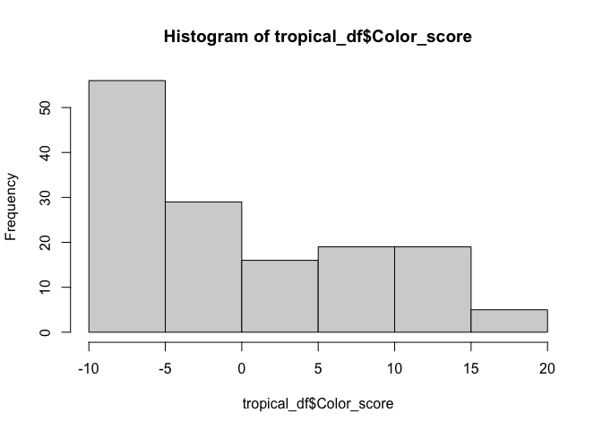
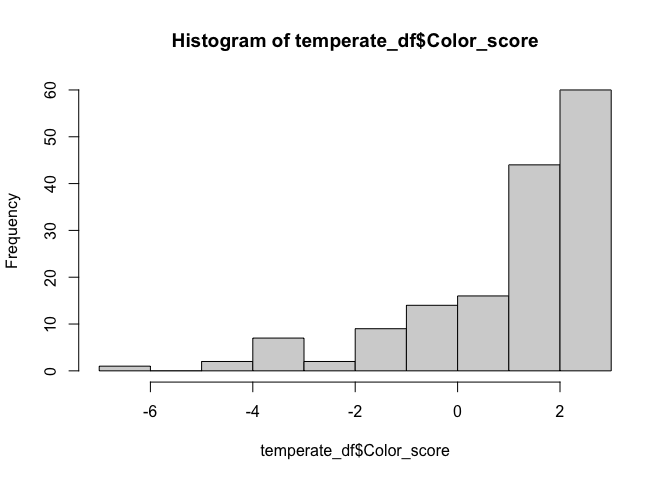
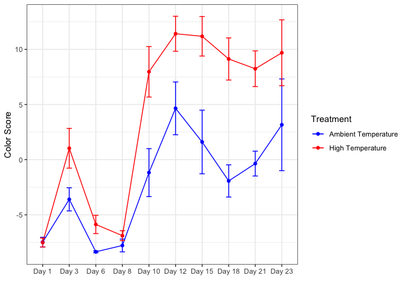
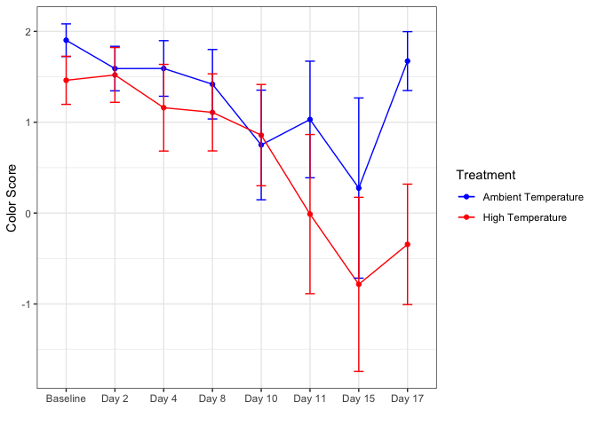

Color Score Analysis for Dani
================
EL Strand

## Loading in required libraries

``` r
library(plyr)
library("vegan")
```

    ## Loading required package: permute

    ## Loading required package: lattice

    ## This is vegan 2.6-4

``` r
library(dplyr)
```

    ## 
    ## Attaching package: 'dplyr'

    ## The following objects are masked from 'package:plyr':
    ## 
    ##     arrange, count, desc, failwith, id, mutate, rename, summarise,
    ##     summarize

    ## The following objects are masked from 'package:stats':
    ## 
    ##     filter, lag

    ## The following objects are masked from 'package:base':
    ## 
    ##     intersect, setdiff, setequal, union

``` r
library(tidyverse)
```

    ## ── Attaching packages
    ## ───────────────────────────────────────
    ## tidyverse 1.3.2 ──

    ## ✔ ggplot2 3.4.0     ✔ purrr   1.0.0
    ## ✔ tibble  3.1.8     ✔ stringr 1.5.0
    ## ✔ tidyr   1.2.1     ✔ forcats 0.5.2
    ## ✔ readr   2.1.3     
    ## ── Conflicts ────────────────────────────────────────── tidyverse_conflicts() ──
    ## ✖ dplyr::arrange()   masks plyr::arrange()
    ## ✖ purrr::compact()   masks plyr::compact()
    ## ✖ dplyr::count()     masks plyr::count()
    ## ✖ dplyr::failwith()  masks plyr::failwith()
    ## ✖ dplyr::filter()    masks stats::filter()
    ## ✖ dplyr::id()        masks plyr::id()
    ## ✖ dplyr::lag()       masks stats::lag()
    ## ✖ dplyr::mutate()    masks plyr::mutate()
    ## ✖ dplyr::rename()    masks plyr::rename()
    ## ✖ dplyr::summarise() masks plyr::summarise()
    ## ✖ dplyr::summarize() masks plyr::summarize()

``` r
library(readxl)
library(writexl)
library(Rmisc)
```

## Read in data

``` r
tropical_data <- read_excel("Tropical_heatwave_color_score_data.xlsx", sheet = "TROPICAL",
                            col_types = c("text", "text", "text",
                                          "numeric", "numeric", "numeric",
                                          "numeric", "numeric", "numeric",
                                          "numeric", "text", "text"))

temperate_data <- read_excel("Tropical_heatwave_color_score_data.xlsx", sheet = "TEMPERATE",
                            col_types = c("text", "text", "text",
                                          "numeric", "numeric", "numeric",
                                          "numeric", "numeric", "numeric",
                                          "numeric", "text"))
```

## Create sample ID column

``` r
tropical_data <- tropical_data %>% 
  unite(Sample, c("Timepoint", "Tank_Number", "Fragment_Number"), sep = " ", remove = FALSE) 

temperate_data <- temperate_data %>% 
  unite(Sample, c("Timepoint", "Tank_Number", "Fragment_Number"), sep = " ", remove = FALSE) 
```

## Normalizing to color standards

Tropical set

``` r
tropical_data$Red.Norm.Coral <- tropical_data$Red_coral/tropical_data$Red_standard
tropical_data$Green.Norm.Coral <- tropical_data$Green_coral/tropical_data$Green_standard
tropical_data$Blue.Norm.Coral <- tropical_data$Blue_coral/tropical_data$Blue_standard

head(tropical_data)
```

    ## # A tibble: 6 × 16
    ##   Sample Timep…¹ Tank_…² Fragm…³ Photo…⁴ Red_s…⁵ Green…⁶ Blue_…⁷ Red_c…⁸ Green…⁹
    ##   <chr>  <chr>   <chr>   <chr>     <dbl>   <dbl>   <dbl>   <dbl>   <dbl>   <dbl>
    ## 1 20220… 202204… 1       1          9783    137.    29.4    96.4   127.     98.5
    ## 2 20220… 202204… 1       2          9784    136.    28.7    94.3    93.0    65.6
    ## 3 20220… 202204… 2       1          9787    134.    22.9    84.6   141.    108. 
    ## 4 20220… 202204… 2       2          9792    133.    27.5    98.1   127.    102. 
    ## 5 20220… 202204… 3       1          9795    148.    33.4   102.    122.     90.5
    ## 6 20220… 202204… 3       2          9800    112.    19.2    76.9   107.     84.8
    ## # … with 6 more variables: Blue_coral <dbl>, Date_analyzed <chr>, Notes <chr>,
    ## #   Red.Norm.Coral <dbl>, Green.Norm.Coral <dbl>, Blue.Norm.Coral <dbl>, and
    ## #   abbreviated variable names ¹​Timepoint, ²​Tank_Number, ³​Fragment_Number,
    ## #   ⁴​Photo_analyzed, ⁵​Red_standard, ⁶​Green_standard, ⁷​Blue_standard,
    ## #   ⁸​Red_coral, ⁹​Green_coral

Temperate set

``` r
temperate_data$Red.Norm.Coral <- temperate_data$Red_coral/temperate_data$Red_standard
temperate_data$Green.Norm.Coral <- temperate_data$Green_coral/temperate_data$Green_standard
temperate_data$Blue.Norm.Coral <- temperate_data$Blue_coral/temperate_data$Blue_standard

head(temperate_data)
```

    ## # A tibble: 6 × 15
    ##   Sample Timep…¹ Tank_…² Fragm…³ Photo…⁴ Red_s…⁵ Green…⁶ Blue_…⁷ Red_c…⁸ Green…⁹
    ##   <chr>  <chr>   <chr>   <chr>     <dbl>   <dbl>   <dbl>   <dbl>   <dbl>   <dbl>
    ## 1 20221… 202210… 1       1          1112    156.    72.1   117.    136.     99.1
    ## 2 20221… 202210… 1       2          1114    148.    71.5   101.     89.9    71.3
    ## 3 20221… 202210… 1       3          1116    163.    85.0   114.    155.    124. 
    ## 4 20221… 202210… 1       5          1117    158.    79.7   105.    121.     75.1
    ## 5 20221… 202210… 3       1          1121    139.    72.8    87.7   150.    101. 
    ## 6 20221… 202210… 3       2          1123    146.    63.4    98.5    98.9    64.8
    ## # … with 5 more variables: Blue_coral <dbl>, Date_analyzed <chr>,
    ## #   Red.Norm.Coral <dbl>, Green.Norm.Coral <dbl>, Blue.Norm.Coral <dbl>, and
    ## #   abbreviated variable names ¹​Timepoint, ²​Tank_Number, ³​Fragment_Number,
    ## #   ⁴​Photo_analyzed, ⁵​Red_standard, ⁶​Green_standard, ⁷​Blue_standard,
    ## #   ⁸​Red_coral, ⁹​Green_coral

## Principal Components Analysis to find ‘Color Score’ value

### Create data matrix and name columns

Tropical set

``` r
tropical_matrix <- as.matrix(cbind(tropical_data$Red.Norm.Coral,
                                   tropical_data$Green.Norm.Coral,
                                   tropical_data$Blue.Norm.Coral)) #create matrix

rownames(tropical_matrix) <- tropical_data$Sample #name columns in dataframe
```

Temperate set

``` r
temperate_matrix <- as.matrix(cbind(temperate_data$Red.Norm.Coral,
                                   temperate_data$Green.Norm.Coral,
                                   temperate_data$Blue.Norm.Coral)) #create matrix

rownames(temperate_matrix) <- temperate_data$Sample #name columns in dataframe
```

### Calculate distance matrix of color scores

``` r
tropical_dist <- vegdist(tropical_matrix, method="euclidean") 
temperate_dist <- vegdist(temperate_matrix, method="euclidean") 
```

### Calculate PCA

``` r
trop_PCA <- princomp(tropical_dist) #run principal components Analysis
summary(trop_PCA) # view variance explained by PCs
```

    ## Importance of components:
    ##                           Comp.1    Comp.2     Comp.3      Comp.4      Comp.5
    ## Standard deviation     7.9454088 4.1633263 0.94069610 0.745810264 0.336235388
    ## Proportion of Variance 0.7669955 0.2105917 0.01075125 0.006757982 0.001373558
    ## Cumulative Proportion  0.7669955 0.9775871 0.98833840 0.995096380 0.996469938
    ##                              Comp.6       Comp.7       Comp.8       Comp.9
    ## Standard deviation     0.2865672324 0.2482918952 0.1670402981 0.1554612138
    ## Proportion of Variance 0.0009977308 0.0007490062 0.0003390024 0.0002936327
    ## Cumulative Proportion  0.9974676687 0.9982166749 0.9985556773 0.9988493100
    ##                             Comp.10      Comp.11      Comp.12      Comp.13
    ## Standard deviation     0.1304730253 0.1092320552 0.0975779444 8.706814e-02
    ## Proportion of Variance 0.0002068244 0.0001449641 0.0001156814 9.210406e-05
    ## Cumulative Proportion  0.9990561344 0.9992010985 0.9993167799 9.994089e-01
    ##                             Comp.14      Comp.15      Comp.16      Comp.17
    ## Standard deviation     7.868682e-02 6.723964e-02 5.839585e-02 5.742267e-02
    ## Proportion of Variance 7.522537e-05 5.493018e-05 4.143089e-05 4.006148e-05
    ## Cumulative Proportion  9.994841e-01 9.995390e-01 9.995805e-01 9.996205e-01
    ##                             Comp.18      Comp.19      Comp.20      Comp.21
    ## Standard deviation     5.268322e-02 0.0494037603 4.720968e-02 4.531862e-02
    ## Proportion of Variance 3.372135e-05 0.0000296538 2.707837e-05 2.495248e-05
    ## Cumulative Proportion  9.996543e-01 0.9996839071 9.997110e-01 9.997359e-01
    ##                             Comp.22      Comp.23      Comp.24      Comp.25
    ## Standard deviation     4.106964e-02 3.953600e-02 3.684064e-02 3.496098e-02
    ## Proportion of Variance 2.049283e-05 1.899091e-05 1.648977e-05 1.485003e-05
    ## Cumulative Proportion  9.997564e-01 9.997754e-01 9.997919e-01 9.998068e-01
    ##                             Comp.26      Comp.27      Comp.28      Comp.29
    ## Standard deviation     3.183693e-02 3.046441e-02 2.875447e-02 2.843765e-02
    ## Proportion of Variance 1.231466e-05 1.127576e-05 1.004549e-05 9.825346e-06
    ## Cumulative Proportion  9.998191e-01 9.998304e-01 9.998404e-01 9.998502e-01
    ##                             Comp.30      Comp.31      Comp.32      Comp.33
    ## Standard deviation     2.684741e-02 2.513135e-02 2.316694e-02 2.240115e-02
    ## Proportion of Variance 8.757194e-06 7.673471e-06 6.520753e-06 6.096786e-06
    ## Cumulative Proportion  9.998590e-01 9.998667e-01 9.998732e-01 9.998793e-01
    ##                             Comp.34      Comp.35      Comp.36      Comp.37
    ## Standard deviation     2.222377e-02 2.162277e-02 2.115695e-02 2.060635e-02
    ## Proportion of Variance 6.000613e-06 5.680452e-06 5.438338e-06 5.158964e-06
    ## Cumulative Proportion  9.998853e-01 9.998910e-01 9.998964e-01 9.999015e-01
    ##                             Comp.38      Comp.39      Comp.40      Comp.41
    ## Standard deviation     2.015758e-02 1.986376e-02 1.873281e-02 1.813334e-02
    ## Proportion of Variance 4.936705e-06 4.793836e-06 4.263497e-06 3.994992e-06
    ## Cumulative Proportion  9.999065e-01 9.999113e-01 9.999155e-01 9.999195e-01
    ##                             Comp.42      Comp.43      Comp.44      Comp.45
    ## Standard deviation     1.771213e-02 1.646807e-02 1.594802e-02 0.0157184856
    ## Proportion of Variance 3.811553e-06 3.294926e-06 3.090111e-06 0.0000030018
    ## Cumulative Proportion  9.999233e-01 9.999266e-01 9.999297e-01 0.9999327367
    ##                             Comp.46      Comp.47      Comp.48      Comp.49
    ## Standard deviation     1.523653e-02 1.435776e-02 1.413304e-02 1.395458e-02
    ## Proportion of Variance 2.820540e-06 2.504572e-06 2.426787e-06 2.365887e-06
    ## Cumulative Proportion  9.999356e-01 9.999381e-01 9.999405e-01 9.999429e-01
    ##                             Comp.50      Comp.51      Comp.52      Comp.53
    ## Standard deviation     1.348962e-02 1.335216e-02 1.304062e-02 1.243018e-02
    ## Proportion of Variance 2.210853e-06 2.166023e-06 2.066127e-06 1.877220e-06
    ## Cumulative Proportion  9.999451e-01 9.999472e-01 9.999493e-01 9.999512e-01
    ##                             Comp.54      Comp.55      Comp.56      Comp.57
    ## Standard deviation     1.214076e-02 1.175568e-02 1.161352e-02 1.149175e-02
    ## Proportion of Variance 1.790820e-06 1.679020e-06 1.638656e-06 1.604474e-06
    ## Cumulative Proportion  9.999530e-01 9.999546e-01 9.999563e-01 9.999579e-01
    ##                             Comp.58      Comp.59      Comp.60      Comp.61
    ## Standard deviation     1.143815e-02 1.114225e-02 1.063910e-02 1.050738e-02
    ## Proportion of Variance 1.589541e-06 1.508365e-06 1.375214e-06 1.341372e-06
    ## Cumulative Proportion  9.999595e-01 9.999610e-01 9.999624e-01 9.999637e-01
    ##                             Comp.62      Comp.63      Comp.64      Comp.65
    ## Standard deviation     1.008805e-02 9.956602e-03 9.770489e-03 9.569844e-03
    ## Proportion of Variance 1.236446e-06 1.204433e-06 1.159826e-06 1.112679e-06
    ## Cumulative Proportion  9.999649e-01 9.999661e-01 9.999673e-01 9.999684e-01
    ##                             Comp.66      Comp.67      Comp.68      Comp.69
    ## Standard deviation     9.328869e-03 9.276090e-03 9.252474e-03 9.234396e-03
    ## Proportion of Variance 1.057349e-06 1.045419e-06 1.040102e-06 1.036042e-06
    ## Cumulative Proportion  9.999695e-01 9.999705e-01 9.999716e-01 9.999726e-01
    ##                             Comp.70      Comp.71      Comp.72      Comp.73
    ## Standard deviation     9.001711e-03 8.803769e-03 8.717449e-03 8.537924e-03
    ## Proportion of Variance 9.844880e-07 9.416674e-07 9.232921e-07 8.856555e-07
    ## Cumulative Proportion  9.999736e-01 9.999745e-01 9.999754e-01 9.999763e-01
    ##                             Comp.74      Comp.75      Comp.76      Comp.77
    ## Standard deviation     8.500471e-03 8.359567e-03 8.245308e-03 8.009034e-03
    ## Proportion of Variance 8.779025e-07 8.490394e-07 8.259885e-07 7.793285e-07
    ## Cumulative Proportion  9.999772e-01 9.999781e-01 9.999789e-01 9.999797e-01
    ##                             Comp.78      Comp.79      Comp.80      Comp.81
    ## Standard deviation     8.001581e-03 7.904899e-03 7.849113e-03 7.693089e-03
    ## Proportion of Variance 7.778788e-07 7.591942e-07 7.485167e-07 7.190546e-07
    ## Cumulative Proportion  9.999804e-01 9.999812e-01 9.999819e-01 9.999827e-01
    ##                             Comp.82      Comp.83      Comp.84      Comp.85
    ## Standard deviation     7.502850e-03 7.436805e-03 7.358735e-03 7.284841e-03
    ## Proportion of Variance 6.839319e-07 6.719440e-07 6.579102e-07 6.447634e-07
    ## Cumulative Proportion  9.999834e-01 9.999840e-01 9.999847e-01 9.999853e-01
    ##                             Comp.86      Comp.87      Comp.88      Comp.89
    ## Standard deviation     7.004978e-03 7.002360e-03 6.786264e-03 6.567416e-03
    ## Proportion of Variance 5.961751e-07 5.957295e-07 5.595280e-07 5.240219e-07
    ## Cumulative Proportion  9.999859e-01 9.999865e-01 9.999871e-01 9.999876e-01
    ##                             Comp.90      Comp.91      Comp.92      Comp.93
    ## Standard deviation     6.364069e-03 6.355427e-03 6.266459e-03 5.952603e-03
    ## Proportion of Variance 4.920736e-07 4.907382e-07 4.770948e-07 4.305010e-07
    ## Cumulative Proportion  9.999881e-01 9.999886e-01 9.999891e-01 9.999895e-01
    ##                             Comp.94      Comp.95      Comp.96      Comp.97
    ## Standard deviation     5.918750e-03 5.908139e-03 5.742536e-03 5.717189e-03
    ## Proportion of Variance 4.256183e-07 4.240935e-07 4.006524e-07 3.971233e-07
    ## Cumulative Proportion  9.999899e-01 9.999903e-01 9.999907e-01 9.999911e-01
    ##                             Comp.98      Comp.99     Comp.100     Comp.101
    ## Standard deviation     5.618937e-03 5.607077e-03 5.504735e-03 5.481732e-03
    ## Proportion of Variance 3.835911e-07 3.819736e-07 3.681571e-07 3.650866e-07
    ## Cumulative Proportion  9.999915e-01 9.999919e-01 9.999923e-01 9.999926e-01
    ##                            Comp.102     Comp.103     Comp.104     Comp.105
    ## Standard deviation     5.326615e-03 5.306072e-03 5.276982e-03 5.125745e-03
    ## Proportion of Variance 3.447171e-07 3.420633e-07 3.383230e-07 3.192084e-07
    ## Cumulative Proportion  9.999930e-01 9.999933e-01 9.999937e-01 9.999940e-01
    ##                            Comp.106     Comp.107     Comp.108     Comp.109
    ## Standard deviation     5.023764e-03 4.888421e-03 4.838070e-03 4.784170e-03
    ## Proportion of Variance 3.066329e-07 2.903338e-07 2.843836e-07 2.780824e-07
    ## Cumulative Proportion  9.999943e-01 9.999946e-01 9.999949e-01 9.999951e-01
    ##                            Comp.110     Comp.111     Comp.112     Comp.113
    ## Standard deviation     4.714810e-03 4.648556e-03 4.584674e-03 4.561660e-03
    ## Proportion of Variance 2.700776e-07 2.625406e-07 2.553743e-07 2.528169e-07
    ## Cumulative Proportion  9.999954e-01 9.999957e-01 9.999959e-01 9.999962e-01
    ##                            Comp.114     Comp.115     Comp.116     Comp.117
    ## Standard deviation     4.558376e-03 4.503234e-03 4.360015e-03 4.302975e-03
    ## Proportion of Variance 2.524530e-07 2.463822e-07 2.309597e-07 2.249562e-07
    ## Cumulative Proportion  9.999964e-01 9.999967e-01 9.999969e-01 9.999971e-01
    ##                            Comp.118     Comp.119     Comp.120     Comp.121
    ## Standard deviation     4.216711e-03 4.143490e-03 4.139166e-03 3.705783e-03
    ## Proportion of Variance 2.160269e-07 2.085898e-07 2.081546e-07 1.668477e-07
    ## Cumulative Proportion  9.999974e-01 9.999976e-01 9.999978e-01 9.999979e-01
    ##                            Comp.122     Comp.123     Comp.124     Comp.125
    ## Standard deviation     3.635753e-03 3.632210e-03 3.511633e-03 3.505648e-03
    ## Proportion of Variance 1.606013e-07 1.602884e-07 1.498230e-07 1.493127e-07
    ## Cumulative Proportion  9.999981e-01 9.999983e-01 9.999984e-01 9.999986e-01
    ##                            Comp.126     Comp.127     Comp.128     Comp.129
    ## Standard deviation     3.420978e-03 3.319156e-03 3.318585e-03 3.181091e-03
    ## Proportion of Variance 1.421874e-07 1.338492e-07 1.338031e-07 1.229455e-07
    ## Cumulative Proportion  9.999987e-01 9.999988e-01 9.999990e-01 9.999991e-01
    ##                            Comp.130     Comp.131     Comp.132     Comp.133
    ## Standard deviation     3.161125e-03 3.086828e-03 3.078099e-03 2.907501e-03
    ## Proportion of Variance 1.214069e-07 1.157671e-07 1.151133e-07 1.027070e-07
    ## Cumulative Proportion  9.999992e-01 9.999993e-01 9.999994e-01 9.999995e-01
    ##                            Comp.134     Comp.135     Comp.136     Comp.137
    ## Standard deviation     2.750063e-03 2.508489e-03 2.215115e-03 2.158564e-03
    ## Proportion of Variance 9.188524e-08 7.645125e-08 5.961463e-08 5.660962e-08
    ## Cumulative Proportion  9.999996e-01 9.999997e-01 9.999998e-01 9.999998e-01
    ##                            Comp.138     Comp.139     Comp.140     Comp.141
    ## Standard deviation     2.061479e-03 1.943053e-03 1.660490e-03 1.171468e-03
    ## Proportion of Variance 5.163192e-08 4.587008e-08 3.349906e-08 1.667330e-08
    ## Cumulative Proportion  9.999999e-01 9.999999e-01 1.000000e+00 1.000000e+00
    ##                            Comp.142     Comp.143     Comp.144
    ## Standard deviation     1.072333e-03 9.016430e-04 1.037147e-08
    ## Proportion of Variance 1.397075e-08 9.877102e-09 1.306896e-18
    ## Cumulative Proportion  1.000000e+00 1.000000e+00 1.000000e+00

``` r
temp_PCA <- princomp(temperate_dist)
summary(temp_PCA)
```

    ## Importance of components:
    ##                            Comp.1     Comp.2      Comp.3       Comp.4
    ## Standard deviation     12.4253400 2.91761507 0.735296862 0.3035494602
    ## Proportion of Variance  0.9433851 0.05201498 0.003303679 0.0005630298
    ## Cumulative Proportion   0.9433851 0.99540006 0.998703736 0.9992667659
    ##                              Comp.5       Comp.6       Comp.7       Comp.8
    ## Standard deviation     0.2025221151 0.1599268326 1.267068e-01 9.582244e-02
    ## Proportion of Variance 0.0002506209 0.0001562842 9.810074e-05 5.610569e-05
    ## Cumulative Proportion  0.9995173869 0.9996736711 9.997718e-01 9.998279e-01
    ##                              Comp.9      Comp.10      Comp.11      Comp.12
    ## Standard deviation     7.458504e-02 0.0600132544 0.0505057601 4.779636e-02
    ## Proportion of Variance 3.399193e-05 0.0000220073 0.0000155867 1.395925e-05
    ## Cumulative Proportion  9.998619e-01 0.9998838767 0.9998994634 9.999134e-01
    ##                             Comp.13      Comp.14      Comp.15      Comp.16
    ## Standard deviation     4.384627e-02 3.720510e-02 3.612314e-02 3.458455e-02
    ## Proportion of Variance 1.174729e-05 8.458189e-06 7.973399e-06 7.308640e-06
    ## Cumulative Proportion  9.999252e-01 9.999336e-01 9.999416e-01 9.999489e-01
    ##                             Comp.17      Comp.18      Comp.19      Comp.20
    ## Standard deviation     2.772041e-02 2.650119e-02 2.341895e-02 2.121898e-02
    ## Proportion of Variance 4.695390e-06 4.291440e-06 3.351254e-06 2.751195e-06
    ## Cumulative Proportion  9.999536e-01 9.999579e-01 9.999612e-01 9.999640e-01
    ##                             Comp.21      Comp.22      Comp.23      Comp.24
    ## Standard deviation     2.083620e-02 1.932633e-02 1.786896e-02 1.714622e-02
    ## Proportion of Variance 2.652830e-06 2.282293e-06 1.951062e-06 1.796426e-06
    ## Cumulative Proportion  9.999667e-01 9.999689e-01 9.999709e-01 9.999727e-01
    ##                             Comp.25      Comp.26      Comp.27      Comp.28
    ## Standard deviation     1.601696e-02 1.558733e-02 1.482281e-02 1.428013e-02
    ## Proportion of Variance 1.567591e-06 1.484621e-06 1.342559e-06 1.246054e-06
    ## Cumulative Proportion  9.999742e-01 9.999757e-01 9.999771e-01 9.999783e-01
    ##                             Comp.29      Comp.30      Comp.31      Comp.32
    ## Standard deviation     1.378554e-02 1.355294e-02 1.297694e-02 1.269668e-02
    ## Proportion of Variance 1.161235e-06 1.122379e-06 1.029005e-06 9.850382e-07
    ## Cumulative Proportion  9.999795e-01 9.999806e-01 9.999816e-01 9.999826e-01
    ##                             Comp.33      Comp.34      Comp.35      Comp.36
    ## Standard deviation     1.267584e-02 1.222104e-02 1.080133e-02 1.041642e-02
    ## Proportion of Variance 9.818070e-07 9.126172e-07 7.128973e-07 6.629940e-07
    ## Cumulative Proportion  9.999836e-01 9.999845e-01 9.999852e-01 9.999859e-01
    ##                             Comp.37      Comp.38      Comp.39      Comp.40
    ## Standard deviation     1.020732e-02 9.922991e-03 9.818231e-03 9.239265e-03
    ## Proportion of Variance 6.366426e-07 6.016690e-07 5.890321e-07 5.216116e-07
    ## Cumulative Proportion  9.999865e-01 9.999871e-01 9.999877e-01 9.999882e-01
    ##                             Comp.41      Comp.42      Comp.43      Comp.44
    ## Standard deviation     9.012943e-03 8.431463e-03 8.200348e-03 8.148289e-03
    ## Proportion of Variance 4.963701e-07 4.343885e-07 4.109008e-07 4.057003e-07
    ## Cumulative Proportion  9.999887e-01 9.999892e-01 9.999896e-01 9.999900e-01
    ##                             Comp.45      Comp.46      Comp.47      Comp.48
    ## Standard deviation     7.879675e-03 7.821633e-03 7.685624e-03 7.254304e-03
    ## Proportion of Variance 3.793928e-07 3.738241e-07 3.609364e-07 3.215614e-07
    ## Cumulative Proportion  9.999904e-01 9.999907e-01 9.999911e-01 9.999914e-01
    ##                             Comp.49      Comp.50      Comp.51      Comp.52
    ## Standard deviation     7.103908e-03 7.048667e-03 6.883644e-03 6.837043e-03
    ## Proportion of Variance 3.083664e-07 3.035893e-07 2.895405e-07 2.856335e-07
    ## Cumulative Proportion  9.999917e-01 9.999920e-01 9.999923e-01 9.999926e-01
    ##                             Comp.53      Comp.54      Comp.55      Comp.56
    ## Standard deviation     6.614891e-03 6.506347e-03 6.402477e-03 6.379347e-03
    ## Proportion of Variance 2.673732e-07 2.586705e-07 2.504774e-07 2.486709e-07
    ## Cumulative Proportion  9.999929e-01 9.999931e-01 9.999934e-01 9.999936e-01
    ##                             Comp.57      Comp.58      Comp.59      Comp.60
    ## Standard deviation     6.190033e-03 6.158074e-03 5.952539e-03 5.909591e-03
    ## Proportion of Variance 2.341307e-07 2.317193e-07 2.165095e-07 2.133965e-07
    ## Cumulative Proportion  9.999939e-01 9.999941e-01 9.999943e-01 9.999945e-01
    ##                             Comp.61      Comp.62      Comp.63      Comp.64
    ## Standard deviation     5.776028e-03 5.593451e-03 5.378797e-03 5.168265e-03
    ## Proportion of Variance 2.038596e-07 1.911754e-07 1.767839e-07 1.632157e-07
    ## Cumulative Proportion  9.999947e-01 9.999949e-01 9.999951e-01 9.999953e-01
    ##                             Comp.65      Comp.66      Comp.67      Comp.68
    ## Standard deviation     5.115208e-03 5.060747e-03 4.991572e-03 4.900500e-03
    ## Proportion of Variance 1.598818e-07 1.564955e-07 1.522464e-07 1.467416e-07
    ## Cumulative Proportion  9.999954e-01 9.999956e-01 9.999957e-01 9.999959e-01
    ##                             Comp.69      Comp.70      Comp.71      Comp.72
    ## Standard deviation     4.817468e-03 4.713350e-03 4.609474e-03 4.509960e-03
    ## Proportion of Variance 1.418111e-07 1.357475e-07 1.298300e-07 1.242847e-07
    ## Cumulative Proportion  9.999960e-01 9.999962e-01 9.999963e-01 9.999964e-01
    ##                             Comp.73      Comp.74      Comp.75      Comp.76
    ## Standard deviation     4.469037e-03 4.443651e-03 4.263729e-03 4.212697e-03
    ## Proportion of Variance 1.220395e-07 1.206569e-07 1.110840e-07 1.084409e-07
    ## Cumulative Proportion  9.999965e-01 9.999967e-01 9.999968e-01 9.999969e-01
    ##                            Comp.77      Comp.78      Comp.79      Comp.80
    ## Standard deviation     4.09000e-03 4.035486e-03 3.982808e-03 3.897851e-03
    ## Proportion of Variance 1.02216e-07 9.950942e-08 9.692841e-08 9.283737e-08
    ## Cumulative Proportion  9.99997e-01 9.999971e-01 9.999972e-01 9.999973e-01
    ##                             Comp.81      Comp.82      Comp.83      Comp.84
    ## Standard deviation     3.869170e-03 3.761801e-03 3.753210e-03 3.643634e-03
    ## Proportion of Variance 9.147617e-08 8.646972e-08 8.607523e-08 8.112260e-08
    ## Cumulative Proportion  9.999974e-01 9.999974e-01 9.999975e-01 9.999976e-01
    ##                             Comp.85      Comp.86      Comp.87      Comp.88
    ## Standard deviation     3.594350e-03 3.538881e-03 3.494498e-03 3.409272e-03
    ## Proportion of Variance 7.894294e-08 7.652517e-08 7.461774e-08 7.102245e-08
    ## Cumulative Proportion  9.999977e-01 9.999978e-01 9.999978e-01 9.999979e-01
    ##                             Comp.89      Comp.90      Comp.91      Comp.92
    ## Standard deviation     3.370863e-03 3.357256e-03 3.304590e-03 3.257061e-03
    ## Proportion of Variance 6.943121e-08 6.887178e-08 6.672793e-08 6.482225e-08
    ## Cumulative Proportion  9.999980e-01 9.999981e-01 9.999981e-01 9.999982e-01
    ##                             Comp.93      Comp.94      Comp.95      Comp.96
    ## Standard deviation     3.177456e-03 3.144933e-03 3.107121e-03 3.092580e-03
    ## Proportion of Variance 6.169237e-08 6.043594e-08 5.899143e-08 5.844055e-08
    ## Cumulative Proportion  9.999982e-01 9.999983e-01 9.999984e-01 9.999984e-01
    ##                             Comp.97      Comp.98      Comp.99     Comp.100
    ## Standard deviation     2.986288e-03 2.930742e-03 2.856957e-03 2.851915e-03
    ## Proportion of Variance 5.449238e-08 5.248409e-08 4.987464e-08 4.969877e-08
    ## Cumulative Proportion  9.999985e-01 9.999985e-01 9.999986e-01 9.999986e-01
    ##                            Comp.101     Comp.102     Comp.103     Comp.104
    ## Standard deviation     2.843018e-03 2.780036e-03 2.760183e-03 2.734858e-03
    ## Proportion of Variance 4.938917e-08 4.722513e-08 4.655307e-08 4.570270e-08
    ## Cumulative Proportion  9.999987e-01 9.999987e-01 9.999988e-01 9.999988e-01
    ##                            Comp.105     Comp.106     Comp.107     Comp.108
    ## Standard deviation     2.722822e-03 2.709049e-03 2.672271e-03 2.654454e-03
    ## Proportion of Variance 4.530131e-08 4.484420e-08 4.363484e-08 4.305492e-08
    ## Cumulative Proportion  9.999989e-01 9.999989e-01 9.999990e-01 9.999990e-01
    ##                            Comp.109     Comp.110     Comp.111     Comp.112
    ## Standard deviation     2.637286e-03 2.600876e-03 2.531463e-03 2.530885e-03
    ## Proportion of Variance 4.249980e-08 4.133442e-08 3.915756e-08 3.913969e-08
    ## Cumulative Proportion  9.999990e-01 9.999991e-01 9.999991e-01 9.999992e-01
    ##                            Comp.113     Comp.114     Comp.115     Comp.116
    ## Standard deviation     2.490592e-03 2.469254e-03 2.463666e-03 2.425899e-03
    ## Proportion of Variance 3.790334e-08 3.725668e-08 3.708824e-08 3.595985e-08
    ## Cumulative Proportion  9.999992e-01 9.999992e-01 9.999993e-01 9.999993e-01
    ##                            Comp.117     Comp.118     Comp.119     Comp.120
    ## Standard deviation     2.409448e-03 2.303903e-03 2.253631e-03 2.246973e-03
    ## Proportion of Variance 3.547379e-08 3.243402e-08 3.103403e-08 3.085093e-08
    ## Cumulative Proportion  9.999993e-01 9.999994e-01 9.999994e-01 9.999994e-01
    ##                            Comp.121     Comp.122     Comp.123     Comp.124
    ## Standard deviation     2.240496e-03 2.201539e-03 2.128603e-03 2.105022e-03
    ## Proportion of Variance 3.067333e-08 2.961591e-08 2.768610e-08 2.707607e-08
    ## Cumulative Proportion  9.999995e-01 9.999995e-01 9.999995e-01 9.999995e-01
    ##                            Comp.125     Comp.126     Comp.127     Comp.128
    ## Standard deviation     2.074582e-03 2.044665e-03 2.020854e-03 1.996510e-03
    ## Proportion of Variance 2.629866e-08 2.554563e-08 2.495411e-08 2.435652e-08
    ## Cumulative Proportion  9.999996e-01 9.999996e-01 9.999996e-01 9.999997e-01
    ##                            Comp.129     Comp.130     Comp.131     Comp.132
    ## Standard deviation     1.986898e-03 1.909530e-03 1.827207e-03 1.809869e-03
    ## Proportion of Variance 2.412256e-08 2.228053e-08 2.040083e-08 2.001552e-08
    ## Cumulative Proportion  9.999997e-01 9.999997e-01 9.999997e-01 9.999997e-01
    ##                            Comp.133     Comp.134     Comp.135     Comp.136
    ## Standard deviation     1.796227e-03 1.735716e-03 1.735420e-03 1.712285e-03
    ## Proportion of Variance 1.971490e-08 1.840897e-08 1.840271e-08 1.791532e-08
    ## Cumulative Proportion  9.999998e-01 9.999998e-01 9.999998e-01 9.999998e-01
    ##                            Comp.137     Comp.138     Comp.139     Comp.140
    ## Standard deviation     1.611864e-03 1.574188e-03 1.538135e-03 1.499517e-03
    ## Proportion of Variance 1.587557e-08 1.514209e-08 1.445644e-08 1.373964e-08
    ## Cumulative Proportion  9.999998e-01 9.999998e-01 9.999999e-01 9.999999e-01
    ##                            Comp.141     Comp.142     Comp.143     Comp.144
    ## Standard deviation     1.464560e-03 1.425242e-03 1.422939e-03 1.400335e-03
    ## Proportion of Variance 1.310651e-08 1.241222e-08 1.237214e-08 1.198219e-08
    ## Cumulative Proportion  9.999999e-01 9.999999e-01 9.999999e-01 9.999999e-01
    ##                            Comp.145     Comp.146     Comp.147     Comp.148
    ## Standard deviation     1.388040e-03 1.339784e-03 1.297630e-03 1.256634e-03
    ## Proportion of Variance 1.177271e-08 1.096837e-08 1.028902e-08 9.649173e-09
    ## Cumulative Proportion  9.999999e-01 9.999999e-01 1.000000e+00 1.000000e+00
    ##                            Comp.149     Comp.150     Comp.151     Comp.152
    ## Standard deviation     1.219844e-03 1.081833e-03 1.004392e-03 9.349028e-04
    ## Proportion of Variance 9.092447e-09 7.151423e-09 6.164229e-09 5.340788e-09
    ## Cumulative Proportion  1.000000e+00 1.000000e+00 1.000000e+00 1.000000e+00
    ##                            Comp.153     Comp.154     Comp.155     Comp.156
    ## Standard deviation     8.163510e-04 6.930587e-04 4.385855e-04 1.804786e-08
    ## Proportion of Variance 4.072174e-09 2.935030e-09 1.175387e-09 1.990325e-18
    ## Cumulative Proportion  1.000000e+00 1.000000e+00 1.000000e+00 1.000000e+00

### Extract PC1 as color score value

Tropical set

``` r
Tropical_colorscore <- as.data.frame(-trop_PCA$scores[,1]) #extract PC1
Tropical_colorscore$Sample <- rownames(tropical_matrix)

Tropical_colorscore <- Tropical_colorscore %>% dplyr::rename(., Color_score = `-trop_PCA$scores[, 1]`)
```

Temperate set

``` r
Temperate_colorscore <- as.data.frame(-temp_PCA$scores[,1]) #extract PC1
Temperate_colorscore$Sample <- rownames(temperate_matrix)

Temperate_colorscore <- Temperate_colorscore %>% dplyr::rename(., Color_score = `-temp_PCA$scores[, 1]`)
```

## Create final data frame

``` r
tropical_data_final <- left_join(tropical_data, Tropical_colorscore, by = "Sample") 

temperate_data_final <- left_join(temperate_data, Temperate_colorscore, by = "Sample")
```

## Export that data frame

``` r
tropical_data_final %>% write_xlsx("Tropical_colorscore.xlsx")
temperate_data_final %>% write_xlsx("Temperate_colorscore.xlsx")
```

# Analysis

## Import data frame from the above so don’t have to run code again

``` r
tropical_df <- read_excel("Tropical_colorscore.xlsx") %>% 
  select(1:4,17) %>%
  mutate(Treatment = case_when(Tank_Number == "1" ~ "Ambient Temperature", 
                               Tank_Number == "2" ~ "High Temperature",
                               Tank_Number == "3" ~ "Ambient Temperature",
                               Tank_Number == "4" ~ "High Temperature")) %>%
  mutate(Date = case_when(Timepoint == "20220329" ~ "Day 1", 
                          Timepoint == "20220331" ~ "Day 3",
                          Timepoint == "20220402" ~ "Day 6",
                          Timepoint == "20220404" ~ "Day 8",
                          Timepoint == "20220406" ~ "Day 10",
                          Timepoint == "20220408" ~ "Day 12",
                          Timepoint == "20220411" ~ "Day 15",
                          Timepoint == "20220414" ~ "Day 18",
                          Timepoint == "20220417" ~ "Day 21",
                          Timepoint == "20220419" ~ "Day 23"))

tropical_df$Date <- factor(tropical_df$Date, 
                           levels = c("Day 1", "Day 3", "Day 6", "Day 8",
                                      "Day 10", "Day 12", "Day 15", "Day 18",
                                      "Day 21", "Day 23"))

tropical_df %>% write_xlsx("Tropical_colorscore_meta.xlsx")

temperate_df <- read_excel("Temperate_colorscore.xlsx") %>% 
  select(2:4,16) %>% 
  mutate(Treatment = case_when(Tank_Number == "1" ~ "High Temperature", 
                               Tank_Number == "2" ~ "Ambient Temperature",
                               Tank_Number == "3" ~ "High Temperature",
                               Tank_Number == "4" ~ "Ambient Temperature")) %>%
  filter(Color_score > -100) %>% ## this threshold was decided after looking at the histograms below
  mutate(Date = case_when(Timepoint == "20220914" ~ "Baseline", 
                          Timepoint == "20220921" ~ "Day 2",
                          Timepoint == "20220923" ~ "Day 4",
                          Timepoint == "20220927" ~ "Day 8",
                          Timepoint == "20220929" ~ "Day 10",
                          Timepoint == "20220930" ~ "Day 11",
                          Timepoint == "20221004" ~ "Day 15",
                          Timepoint == "20221006" ~ "Day 17"))

temperate_df$Date <- factor(temperate_df$Date, 
                           levels = c("Baseline", "Day 2", "Day 4", "Day 8",
                                      "Day 10", "Day 11", "Day 15", "Day 17"))

temperate_df %>% write_xlsx("Temperate_colorscore_meta.xlsx")
```

``` r
hist(tropical_df$Color_score)
```

<!-- -->

``` r
hist(temperate_df$Color_score)
```

<!-- -->

``` r
tropical_means <- summarySE(tropical_df, measurevar = c("Color_score"), groupvars = c("Date", "Treatment"))
temperate_means <- summarySE(temperate_df, measurevar = c("Color_score"), groupvars = c("Date", "Treatment"))
```

``` r
tropical_means %>%
  ggplot(., aes(x=Date, y=Color_score, group=Treatment, color=Treatment)) +
  geom_point() + geom_line() + 
  scale_color_manual(values = c("blue", "red")) +
  geom_errorbar(aes(ymin=Color_score-se, ymax=Color_score+se), width=.2) +
  theme_bw() + ylab("Color Score") + 
  xlab("")
```

<!-- -->

``` r
temperate_means %>%
  ggplot(., aes(x=Date, y=Color_score, group=Treatment, color=Treatment)) +
  geom_point() + geom_line() + 
  scale_color_manual(values = c("blue", "red")) +
  geom_errorbar(aes(ymin=Color_score-se, ymax=Color_score+se), width=.2) +
  theme_bw() + ylab("Color Score") + 
  xlab("")
```

<!-- -->
